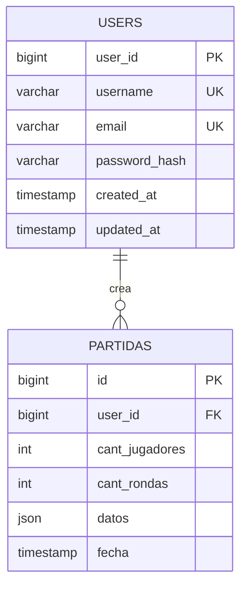

## Modelado de Datos

### A) DER (Diagrama Entidad-Relación)

Notas:
- `datos` encapsula estado por ronda: `puntajesPorRonda`, `estado` (tablero), `kingPorRonda`.

### B) Esquema Relacional Normalizado (hasta 3FN)

Transformación DER→Tablas:
- Tabla `users(user_id PK, username UK, email UK, password_hash, created_at, updated_at)`
- Tabla `partidas(id PK, user_id FK→users.user_id, game_id NULL, cant_jugadores, cant_rondas, datos JSON, fecha)`

3FN:
- Atributos atómicos por tabla (1FN): strings, números y JSON como contenedor de estado complejo del tablero.
- Dependencias completas de la PK (2FN): en `partidas`, los atributos dependen de `id` (PK). En `users`, dependen de `user_id`.
- Sin dependencias transitivas (3FN): `username` y `email` no determinan otros campos fuera de la PK; se declaran únicas para identidad.

Decisión sobre JSON:
- El estado del tablero es altamente jerárquico, variante por ronda y recinto. Normalizarlo a múltiples tablas complicaría la implementación sin beneficios claros en esta fase. Se justifica guardar en `datos` (JSON) con estructura documentada en README para simplicidad y rendimiento de escritura/lectura.

Claves y restricciones:
- PK: `users.user_id`, `partidas.id`.
- UK: `users.username`, `users.email`.
- FK: `partidas.user_id` → `users.user_id` (ON DELETE CASCADE).
- Índices: `ix_users_username`, `ix_users_email`, `ix_partidas_user_fecha`.

### C) Restricciones No Estructurales (Reglas del juego)

1) Colocación por recinto
- SAME_FOREST: todas las piezas del recinto deben ser de la misma especie.
- DIFFERENT_MEADOW: todas las piezas del recinto deben ser de especies diferentes.
- TRIO_TREES: puntúa si hay exactamente 3 piezas.
- LONELY: puntúa si hay exactamente 1 pieza.
- KING: con `kingPorRonda["Ronda X"]` true, puntúa +7 si hay exactamente 1 pieza.
- RIVER: puntúa 1 por pieza colocada.

Implementación:
- Cliente (JS): validaciones previas al guardar en `scriptSeguimiento.js` (bloquea acciones inválidas y calcula puntajes).
- Servidor (PHP): actualmente confía en el cliente. Opcional: agregar validación secundaria del payload para reforzar reglas antes de persistir.

2) Límites por ronda
- Máximo 6 piezas por ronda en tablero.
- Implementado en JS (`contarDinosTablero` y chequeos en `dropRecinto`).

3) Integridad de usuario y sesión
- Se exige sesión para guardar/listar partidas; se setea en login.

4) Seguridad
- Consultas preparadas en PHP (prevención de SQL Injection).
- Hash de contraseñas con `password_hash`/`password_verify`.

Implementación Física de la Base de Datos

CREATE DATABASE IF NOT EXISTS tricosaurus;
USE tricosaurus;

-- Usuarios
CREATE TABLE IF NOT EXISTS users (
    user_id BIGINT AUTO_INCREMENT PRIMARY KEY,
    username VARCHAR(50) NOT NULL UNIQUE,
    email VARCHAR(120) NULL UNIQUE,
    password_hash VARCHAR(255) NOT NULL,
    created_at TIMESTAMP NOT NULL DEFAULT CURRENT_TIMESTAMP,
    updated_at TIMESTAMP NULL ON UPDATE CURRENT_TIMESTAMP
);

-- Partidas guardadas por usuario
CREATE TABLE IF NOT EXISTS partidas (
    id BIGINT AUTO_INCREMENT PRIMARY KEY,
    user_id BIGINT NOT NULL,
    cant_jugadores INT NOT NULL,
    cant_rondas INT NOT NULL,
    datos JSON NOT NULL,
    fecha TIMESTAMP NOT NULL DEFAULT CURRENT_TIMESTAMP,
    CONSTRAINT fk_partidas_user FOREIGN KEY (user_id) REFERENCES users(user_id) ON DELETE CASCADE
);

-- Índices para consultas frecuentes
CREATE INDEX IF NOT EXISTS ix_users_username ON users (username);
CREATE INDEX IF NOT EXISTS ix_users_email ON users (email);
CREATE INDEX IF NOT EXISTS ix_partidas_user_fecha ON partidas (user_id, fecha);

INSERT

USE tricosaurus;

-- Usuarios
INSERT INTO users (username, email, password_hash) VALUES
('alice', 'alice@example.com', '$2y$10$$2y$12$e493ym5VyAoyt4htyW7ZDucAe5NQC17M0R.OA5LSX1zam7GRxZWkG');
-- Contraseña original: 18991899

-- Partidas de ejemplo
INSERT INTO partidas (user_id, cant_jugadores, cant_rondas, datos)
VALUES
(1, 3, 2, '{
  "estado": {
    "Ronda 1": {
      "KING": ["SPECIE_4_copy_1"],
      "RIVER": [null, null, null, null, null, null],
      "LONELY": [null],
      "TRIO_TREES": ["SPECIE_5_copy_5", null, null],
      "LOVE_MEADOW": [null, null, null, null, null, null],
      "SAME_FOREST": ["SPECIE_5_copy_1", "SPECIE_5_copy_2", "SPECIE_5_copy_3", "SPECIE_5_copy_4", null, null],
      "DIFFERENT_MEADOW": [null, null, null, null, null, null]
    },
    "Ronda 2": {
      "KING": ["SPECIE_2_copy_1"],
      "RIVER": [null, null, null, null, null, null],
      "LONELY": [null],
      "TRIO_TREES": ["SPECIE_4_copy_1", "SPECIE_3_copy_1", null],
      "LOVE_MEADOW": [null, null, null, null, null, null],
      "SAME_FOREST": ["SPECIE_5_copy_1", null, null, null, null, null],
      "DIFFERENT_MEADOW": ["SPECIE_5_copy_2", "SPECIE_2_copy_2", null, null, null, null]
    }
  },
  "puntajesPorRonda": {
    "Ronda 1": 12,
    "Ronda 2": 5,
    "Ronda 3": 0,
    "Ronda 4": 0
  }
}');
